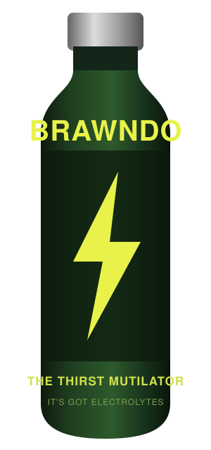

# Your Agent is Starving

NashJS &middot; August 25, 2026 Hosted by Vaco Nashville

---
class: beat
---

## Reads the bundle, not the source

&gt; drag and drop puts the card in the wrong column if you drop it fast. can you fix

&#9679; Read(package.json)

&#9151;&nbsp;&nbsp;"interactjs": "^1.10.28"

&#9679; Bash(ls node_modules/interactjs)

&#9151;&nbsp;&nbsp;LICENSE&nbsp;&nbsp;&nbsp;README.md&nbsp;&nbsp;&nbsp;bower.json&nbsp;&nbsp;&nbsp;dist&nbsp;&nbsp;&nbsp;index.d.ts&nbsp;&nbsp;&nbsp;index.js

&#9679; Read(node_modules/interactjs/dist/interact.min.js)

&#9151;&nbsp;&nbsp;Read 4 lines

/* interact.js 1.10.28 | https://raw.github.com/taye/interact.js/main/LICENSE */

!function(t,e){&quot;object&quot;==typeof exports&amp;&amp;&quot;undefined&quot;!=typeof module?module.expo&hellip;

&#9679; Bash(sed -n '3p' &hellip;/interact.min.js | cut -c 1-2000)

&#9679; Bash(sed -n '3p' &hellip;/interact.min.js | cut -c 2000-4000)

&#9679; Bash(sed -n '3p' &hellip;/interact.min.js | cut -c 4000-6000)

&#9679; The drop target is cached on pointerdown, so a fast drop reads a stale rect.

---
class: whoami
---

&gt; what is my job now that you write all the code

&#9679; Jeremy Mack

&nbsp;&nbsp;Typing code myself&nbsp;&nbsp;&nbsp;&nbsp;&nbsp;&nbsp;&nbsp;13 years

&nbsp;&nbsp;Yelling at agents&nbsp;&nbsp;&nbsp;&nbsp;&nbsp;&nbsp;&nbsp;&nbsp;&nbsp;2 years

&nbsp;&nbsp;Nashville&nbsp;&nbsp;&nbsp;&nbsp;&nbsp;&nbsp;&nbsp;&nbsp;&nbsp;&nbsp;&nbsp;&nbsp;&nbsp;&nbsp;since 2014

&nbsp;&nbsp;Remote&nbsp;&nbsp;&nbsp;&nbsp;&nbsp;&nbsp;&nbsp;&nbsp;&nbsp;&nbsp;&nbsp;&nbsp;&nbsp;&nbsp;&nbsp;&nbsp;&nbsp;&nbsp;&nbsp;10 years

&nbsp;&nbsp;Failed startups&nbsp;&nbsp;&nbsp;&nbsp;&nbsp;&nbsp;&nbsp;&nbsp;&nbsp;&nbsp;&nbsp;several

&nbsp;&nbsp;Vim config&nbsp;&nbsp;&nbsp;&nbsp;&nbsp;&nbsp;&nbsp;&nbsp;&nbsp;&nbsp;&nbsp;&nbsp;&nbsp;immaculate

---
class: beat
---

## You might have seen me earlier this year

---
layout: statement
class: interlude
---

# Why is your agent starving?

---
class: beat
---

## Fetches raw docs from the web

&gt; use effect to read the config file. handle it if the file isnt there

&#9679; WebSearch("effect typescript read a file")

&#9151;&nbsp;&nbsp;Found 8 results

&#9679; WebFetch(effect.website/docs/platform/file-system)

&#9151;&nbsp;&nbsp;Received 412 KB

&#9679; WebFetch(effect.website/docs/getting-started)

&#9151;&nbsp;&nbsp;Received 288 KB

&#9679; Update(src/config.ts)

&#9151;&nbsp;&nbsp;Updated src/config.ts with 12 additions

---
class: beat
---

## Guesses from memory

&gt; add a virtualized list here

&#9679; Read(src/List.tsx)

&#9151;&nbsp;&nbsp;Read 84 lines

&#9679; Update(src/List.tsx)

&#9151;&nbsp;&nbsp;Updated src/List.tsx with 4 additions

&nbsp;&nbsp;&nbsp;&nbsp;14 +&nbsp;&nbsp;const rows = useVirtual({

&#9679; Bash(pnpm tsc --noEmit)

&#9151;&nbsp;&nbsp;error TS2305: '@tanstack/react-virtual' has no exported member

&nbsp;&nbsp;&nbsp;'useVirtual'.

&#9679; Update(src/List.tsx)

&#9151;&nbsp;&nbsp;Updated src/List.tsx with 1 addition, 1 removal

&#9679; Bash(pnpm tsc --noEmit)

&#9151;&nbsp;&nbsp;error TS2353: 'size' does not exist in 'VirtualizerOptions'.

---
class: beat
---

## Clones the repo every time

&gt; can remotion render a downloadable video right in the browser? if so wire it up

&#9679; WebSearch("remotion render video in browser")

&#9151;&nbsp;&nbsp;Found 8 results

&#9679; Bash(git clone --depth 1 https://github.com/remotion-dev/remotion.git /tmp/r)

&#9151;&nbsp;&nbsp;Cloning into '/tmp/r'&hellip; done.

&#9679; Read(/tmp/r/packages/renderer/src/render-frames.ts)

&#9151;&nbsp;&nbsp;Read 340 lines

&#9679; Grep("MediaRecorder", /tmp/r/packages)

&#9151;&nbsp;&nbsp;6 matches

&#9679; Yes. Here is the browser-side render path wired up.

---
layout: statement
class: interlude
---

# Let&rsquo;s feed your agent

npx agent-reference

---
class: beat mid
---

## Paste the setup prompt

agent-reference.dev

agent-referencegithub&nbsp;&nbsp;&nbsp;npm&nbsp;v0.1.0

Give your agents the source

Let your agent do it

Set this project up for agent-reference: run <code>npx agent-reference init</code> and follow the brief it prints.
CopyCopied
<svg class="cursor" v-click="1" viewBox="0 0 24 24" width="26" height="26"><path d="M5 2l14 9-6.6 1.3L9.9 20z" fill="#e8e8d3" stroke="#101010" stroke-width="1.4" stroke-linejoin="round"/></svg>

---
class: beat
---

## Your agent sets itself up

&gt; Set this project up for agent-reference: run `npx agent-reference init` and follow the brief it prints.

&#9679; Bash(npx agent-reference init)

&#9151;&nbsp;&nbsp;transcript stores on this machine

&nbsp;&nbsp;&nbsp;&nbsp;claude-code&nbsp;&nbsp;2,723 sessions&nbsp;&nbsp;&nbsp;&nbsp;&nbsp;&nbsp;codex&nbsp;&nbsp;519&nbsp;&nbsp;&nbsp;&nbsp;&nbsp;&nbsp;opencode&nbsp;&nbsp;147

&nbsp;&nbsp;&nbsp;&hellip; +31 lines (ctrl+o to expand)

&#9679; Bash(rg -o '~/[^ ]+' ~/.claude/projects | uniq -c | sort -rn)

&#9151;&nbsp;&nbsp;312 ~/code/acme/api&nbsp;&nbsp;&nbsp;&nbsp;&nbsp;&nbsp;&nbsp;&nbsp;88 ~/code/acme/workers

&#9679; Write(agent-reference.local.json)

&#9679; Update(.gitignore)

&#9679; Bash(agent-reference validate)

&#9151;&nbsp;&nbsp;agent-reference.local.json&nbsp;&nbsp;ok

&#9679; Set up. I declared the repo you point me at most, and pinned effect and

&nbsp;&nbsp;its v4 docs, since this project installs a prerelease.

---
class: config
---

## What it created

~/code/acme/web/agent-reference.json

{

&nbsp;&nbsp;"packages": {

&nbsp;&nbsp;&nbsp;&nbsp;"npm:effect": {

&nbsp;&nbsp;&nbsp;&nbsp;&nbsp;&nbsp;"version": "4.0.0-rc.111",

&nbsp;&nbsp;&nbsp;&nbsp;&nbsp;&nbsp;"description": "We are on the v4 rc.

&nbsp;&nbsp;&nbsp;&nbsp;&nbsp;&nbsp;&nbsp;&nbsp;Every example online is v3"

&nbsp;&nbsp;&nbsp;&nbsp;}

&nbsp;&nbsp;},

&nbsp;&nbsp;"git": {

&nbsp;&nbsp;&nbsp;&nbsp;"effect-docs": {

&nbsp;&nbsp;&nbsp;&nbsp;&nbsp;&nbsp;"repository": "github:Effect-TS/website",

&nbsp;&nbsp;&nbsp;&nbsp;&nbsp;&nbsp;"directory": "content/docs/v4",

&nbsp;&nbsp;&nbsp;&nbsp;&nbsp;&nbsp;"description": "The v4 docs, which the

&nbsp;&nbsp;&nbsp;&nbsp;&nbsp;&nbsp;&nbsp;&nbsp;site does not publish"

&nbsp;&nbsp;&nbsp;&nbsp;}

&nbsp;&nbsp;}

}

~/code/acme/web/agent-reference.local.json

{

&nbsp;&nbsp;"paths": {

&nbsp;&nbsp;&nbsp;&nbsp;"api": {

&nbsp;&nbsp;&nbsp;&nbsp;&nbsp;&nbsp;"path": "../api",

&nbsp;&nbsp;&nbsp;&nbsp;&nbsp;&nbsp;"description": "Acme's API. Read it

&nbsp;&nbsp;&nbsp;&nbsp;&nbsp;&nbsp;&nbsp;&nbsp;before changing anything the

&nbsp;&nbsp;&nbsp;&nbsp;&nbsp;&nbsp;&nbsp;&nbsp;web app sends or receives"

&nbsp;&nbsp;&nbsp;&nbsp;}

&nbsp;&nbsp;}

}

---
class: beat
---

## agent-reference in action

&gt; use effect to read the config file. handle it if the file isnt there, same as the api does

&#9679; Skill(agent-reference)

&#9151;&nbsp;&nbsp;Launching skill: agent-reference

&#9679; Bash(agent-reference status)

&#9151;&nbsp;&nbsp;effect&nbsp;&nbsp;&nbsp;&nbsp;&nbsp;&nbsp;&nbsp;npm &middot; ready &middot; 4.0.0-rc.111 verified

&nbsp;&nbsp;&nbsp;effect-docs&nbsp;&nbsp;git &middot; ready

&nbsp;&nbsp;&nbsp;api&nbsp;&nbsp;&nbsp;&nbsp;&nbsp;&nbsp;&nbsp;&nbsp;&nbsp;&nbsp;folder &middot; ready &middot; ~/code/acme/api

&#9679; Bash(agent-reference get effect-docs)

&#9151;&nbsp;&nbsp;~/.agent-reference/src/&hellip;/website/6ee985b1/content/docs/v4

&#9679; Read(&hellip;/docs/v4/platform/file-system.mdx)

&#9679; Bash(agent-reference get api)

&#9151;&nbsp;&nbsp;~/code/acme/api

&#9679; Read(~/code/acme/api/src/config.ts)

&#9679; Update(src/config.ts)

&#9679; Bash(pnpm tsc --noEmit)

---
layout: statement
class: interlude
---

# How it works

---
class: config
---

## A name in, a path out

agent-reference.json

{

&nbsp;&nbsp;"packages": {

&nbsp;&nbsp;&nbsp;&nbsp;"npm:effect":

&nbsp;&nbsp;&nbsp;&nbsp;&nbsp;&nbsp;"4.0.0-rc.111"

&nbsp;&nbsp;},

&nbsp;&nbsp;"git": {

&nbsp;&nbsp;&nbsp;&nbsp;"pi":

&nbsp;&nbsp;&nbsp;&nbsp;&nbsp;&nbsp;"github:earendil-works/pi"

&nbsp;&nbsp;}

}

~/.agent-reference/

git/

&nbsp;&nbsp;# bare mirrors,

&nbsp;&nbsp;# one per repository

&nbsp;&nbsp;Effect-TS/effect.git

&nbsp;&nbsp;earendil-works/pi.git

&nbsp;

src/

&nbsp;&nbsp;# one worktree

&nbsp;&nbsp;# per commit

&nbsp;&nbsp;…/effect/6ba41e59/

&nbsp;&nbsp;…/pi/dcd46192/

&nbsp;

state/

&nbsp;&nbsp;# one file

&nbsp;&nbsp;# per project

&nbsp;&nbsp;web-a3f81c04.json

agent

&gt; how does pi stream a tool

&nbsp;&nbsp;result back

&#9679; Bash(agent-reference status)

&#9151;&nbsp;&nbsp;effect&nbsp;&nbsp;npm &middot; ready

&nbsp;&nbsp;&nbsp;pi&nbsp;&nbsp;&nbsp;&nbsp;&nbsp;&nbsp;git &middot; ready

&nbsp;

&#9679; Bash(agent-reference get pi)

&#9151;&nbsp;&nbsp;~/.agent-reference/src/&hellip;

&nbsp;&nbsp;&nbsp;/pi/dcd46192

&nbsp;

&#9679; Read(&hellip;/pi/dcd46192/src/&hellip;)

---
layout: statement
class: interlude
---

# Other types of references

---
class: config
---

## The repos next door

~/code/acme/

├── web/

│&nbsp;&nbsp;&nbsp;└── agent-reference.local.json

├── api/

└── workers/

web/agent-reference.local.json

{

&nbsp;&nbsp;"paths": {

&nbsp;&nbsp;&nbsp;&nbsp;"api": {

&nbsp;&nbsp;&nbsp;&nbsp;&nbsp;&nbsp;"path": "../api",

&nbsp;&nbsp;&nbsp;&nbsp;&nbsp;&nbsp;"description": "Acme's API"

&nbsp;&nbsp;&nbsp;&nbsp;},

&nbsp;&nbsp;&nbsp;&nbsp;"workers": {

&nbsp;&nbsp;&nbsp;&nbsp;&nbsp;&nbsp;"path": "../workers",

&nbsp;&nbsp;&nbsp;&nbsp;&nbsp;&nbsp;"description": "Background jobs"

&nbsp;&nbsp;&nbsp;&nbsp;}

&nbsp;&nbsp;}

}

---
class: config
---

## Repos you reference

agent-reference.json

{

&nbsp;&nbsp;"git": {

&nbsp;&nbsp;&nbsp;&nbsp;"codex": {

&nbsp;&nbsp;&nbsp;&nbsp;&nbsp;&nbsp;"repository": "github:openai/codex",

&nbsp;&nbsp;&nbsp;&nbsp;&nbsp;&nbsp;"description": "OpenAI's coding agent,

&nbsp;&nbsp;&nbsp;&nbsp;&nbsp;&nbsp;&nbsp;&nbsp;written in Rust"

&nbsp;&nbsp;&nbsp;&nbsp;},

&nbsp;&nbsp;&nbsp;&nbsp;"design-system": {

&nbsp;&nbsp;&nbsp;&nbsp;&nbsp;&nbsp;"repository": "git@git.acme.internal:

&nbsp;&nbsp;&nbsp;&nbsp;&nbsp;&nbsp;&nbsp;&nbsp;platform/design-system.git",

&nbsp;&nbsp;&nbsp;&nbsp;&nbsp;&nbsp;"description": "Our components. Read it

&nbsp;&nbsp;&nbsp;&nbsp;&nbsp;&nbsp;&nbsp;&nbsp;before writing a new one"

&nbsp;&nbsp;&nbsp;&nbsp;}

&nbsp;&nbsp;}

}

~/.agent-reference/

git/

&nbsp;&nbsp;github.com/openai/codex.git

&nbsp;&nbsp;git.acme.internal/platform/

&nbsp;&nbsp;&nbsp;&nbsp;design-system.git

&nbsp;

src/

&nbsp;&nbsp;# a read-only worktree, at

&nbsp;&nbsp;# one commit, per repository

&nbsp;&nbsp;…/openai/codex/a4f10b27/

&nbsp;&nbsp;…/design-system/91ce03d4/

---
class: config
---

## Pin exact npm versions

agent-reference.json

{

&nbsp;&nbsp;"packages": {

&nbsp;&nbsp;&nbsp;&nbsp;"npm:ai": {

&nbsp;&nbsp;&nbsp;&nbsp;&nbsp;&nbsp;"version": "7.0.78",

&nbsp;&nbsp;&nbsp;&nbsp;&nbsp;&nbsp;"description": "The Vercel AI SDK. Read its docs/ and changelog

&nbsp;&nbsp;&nbsp;&nbsp;&nbsp;&nbsp;&nbsp;&nbsp;before writing v7; every v6 example on the internet is wrong"

&nbsp;&nbsp;&nbsp;&nbsp;}

&nbsp;&nbsp;}

}

---
class: config
---

## Two versions at once

agent-reference.json

{

&nbsp;&nbsp;"git": {

&nbsp;&nbsp;&nbsp;&nbsp;"zod": {

&nbsp;&nbsp;&nbsp;&nbsp;&nbsp;&nbsp;"repository": "github:colinhacks/zod",

&nbsp;&nbsp;&nbsp;&nbsp;&nbsp;&nbsp;"ref": "v4.1.5",

&nbsp;&nbsp;&nbsp;&nbsp;&nbsp;&nbsp;"description": "What we are moving to"

&nbsp;&nbsp;&nbsp;&nbsp;},

&nbsp;&nbsp;&nbsp;&nbsp;"zod-v3": {

&nbsp;&nbsp;&nbsp;&nbsp;&nbsp;&nbsp;"repository": "github:colinhacks/zod",

&nbsp;&nbsp;&nbsp;&nbsp;&nbsp;&nbsp;"ref": "v3.22.0",

&nbsp;&nbsp;&nbsp;&nbsp;&nbsp;&nbsp;"description": "What we are moving off. Read both sides

&nbsp;&nbsp;&nbsp;&nbsp;&nbsp;&nbsp;&nbsp;&nbsp;before changing a schema"

&nbsp;&nbsp;&nbsp;&nbsp;}

&nbsp;&nbsp;}

}

---
class: config
---

## An optional global config

~/

├── agent-reference.local.json

├── .dotfiles/

└── code/

&nbsp;&nbsp;&nbsp;&nbsp;├── personal/

&nbsp;&nbsp;&nbsp;&nbsp;├── work/

&nbsp;&nbsp;&nbsp;&nbsp;└── forks/

~/agent-reference.local.json

{

&nbsp;&nbsp;"paths": {

&nbsp;&nbsp;&nbsp;&nbsp;"dotfiles": {

&nbsp;&nbsp;&nbsp;&nbsp;&nbsp;&nbsp;"path": "~/.dotfiles",

&nbsp;&nbsp;&nbsp;&nbsp;&nbsp;&nbsp;"description": "Shell and editor"

&nbsp;&nbsp;&nbsp;&nbsp;},

&nbsp;&nbsp;&nbsp;&nbsp;"notes": {

&nbsp;&nbsp;&nbsp;&nbsp;&nbsp;&nbsp;"path": "~/Documents/notes",

&nbsp;&nbsp;&nbsp;&nbsp;&nbsp;&nbsp;"description": "Decisions I keep"

&nbsp;&nbsp;&nbsp;&nbsp;}

&nbsp;&nbsp;}

}

---
class: config
---

## Sets of references

agent-reference.json

"sets": [{

&nbsp;&nbsp;"name": "coding harnesses",

&nbsp;&nbsp;"description": "How others solve this",

&nbsp;&nbsp;"git": [

&nbsp;&nbsp;&nbsp;&nbsp;"github:earendil-works/pi",

&nbsp;&nbsp;&nbsp;&nbsp;"github:openai/codex",

&nbsp;&nbsp;&nbsp;&nbsp;"github:anomalyco/opencode"

&nbsp;&nbsp;]

}]

agent

&gt; how do other harnesses compact context

&#9679; Bash(agent-reference status

&nbsp;&nbsp;&nbsp;&nbsp;--set &quot;coding harnesses&quot;)

&#9151;&nbsp;&nbsp;codex&nbsp;&nbsp;&nbsp;&nbsp;&nbsp;git &middot; ready

&nbsp;&nbsp;&nbsp;pi&nbsp;&nbsp;&nbsp;&nbsp;&nbsp;&nbsp;&nbsp;&nbsp;git &middot; ready

&nbsp;&nbsp;&nbsp;opencode&nbsp;&nbsp;git &middot; ready

&#9679; Read(&hellip;/pi/&hellip;/compaction.ts)

---
class: config
---

## One you commit, one you don&rsquo;t

agent-reference.json

{

&nbsp;&nbsp;"packages": {

&nbsp;&nbsp;&nbsp;&nbsp;"npm:ai": "7.0.78",

&nbsp;&nbsp;&nbsp;&nbsp;"npm:effect": {

&nbsp;&nbsp;&nbsp;&nbsp;&nbsp;&nbsp;"version": "4.0.0-rc.111",

&nbsp;&nbsp;&nbsp;&nbsp;&nbsp;&nbsp;"description": "We are on the v4 rc"

&nbsp;&nbsp;&nbsp;&nbsp;}

&nbsp;&nbsp;},

&nbsp;&nbsp;"git": {

&nbsp;&nbsp;&nbsp;&nbsp;"codex": "github:openai/codex"

&nbsp;&nbsp;},

&nbsp;&nbsp;"paths": {

&nbsp;&nbsp;&nbsp;&nbsp;"decisions": "./docs/decisions"

&nbsp;&nbsp;},

&nbsp;&nbsp;"sets": [{

&nbsp;&nbsp;&nbsp;&nbsp;"name": "coding harnesses",

&nbsp;&nbsp;&nbsp;&nbsp;"git": ["github:earendil-works/pi",

&nbsp;&nbsp;&nbsp;&nbsp;&nbsp;&nbsp;&nbsp;&nbsp;&nbsp;&nbsp;&nbsp;&nbsp;"github:openai/codex"]

&nbsp;&nbsp;}]

}

agent-reference.local.json

{

&nbsp;&nbsp;"paths": {

&nbsp;&nbsp;&nbsp;&nbsp;"api": {

&nbsp;&nbsp;&nbsp;&nbsp;&nbsp;&nbsp;"path": "../api",

&nbsp;&nbsp;&nbsp;&nbsp;&nbsp;&nbsp;"description": "Acme's API"

&nbsp;&nbsp;&nbsp;&nbsp;},

&nbsp;&nbsp;&nbsp;&nbsp;"notes": "~/Documents/notes",

&nbsp;&nbsp;&nbsp;&nbsp;"forks": "~/code/forks"

&nbsp;&nbsp;},

&nbsp;&nbsp;"git": {

&nbsp;&nbsp;&nbsp;&nbsp;"spike": {

&nbsp;&nbsp;&nbsp;&nbsp;&nbsp;&nbsp;"repository": "file:~/code/spike",

&nbsp;&nbsp;&nbsp;&nbsp;&nbsp;&nbsp;"description": "My scratch repo. Never

&nbsp;&nbsp;&nbsp;&nbsp;&nbsp;&nbsp;&nbsp;&nbsp;name this in a commit"

&nbsp;&nbsp;&nbsp;&nbsp;}

&nbsp;&nbsp;}

}

---
layout: statement
class: interlude
---

# Oh yeah, this is a JavaScript meetup

---
class: beat mid
---

An npm package, written in TypeScript

Made by agents, for agents

First-class support for npm dependencies

Reads npm, pnpm, yarn and bun lockfiles

Runs your <code>.ts</code> with no build step

---
layout: statement
class: dark closer
---

# agent-reference.dev

It&rsquo;s got what agents crave

Questions? &middot; x.com/mutewinter &middot; hi@mutewinter.com

