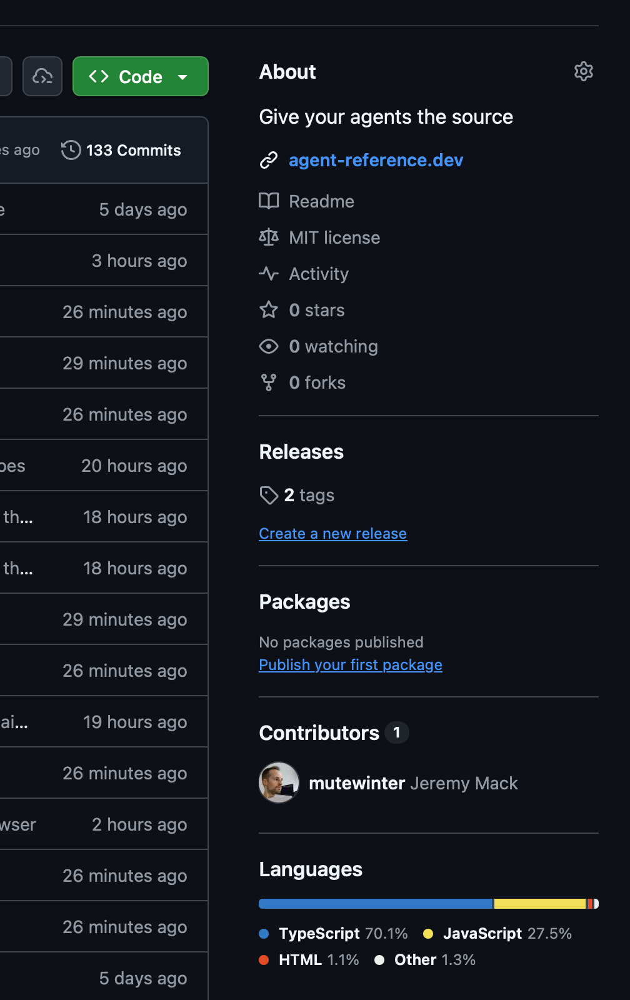
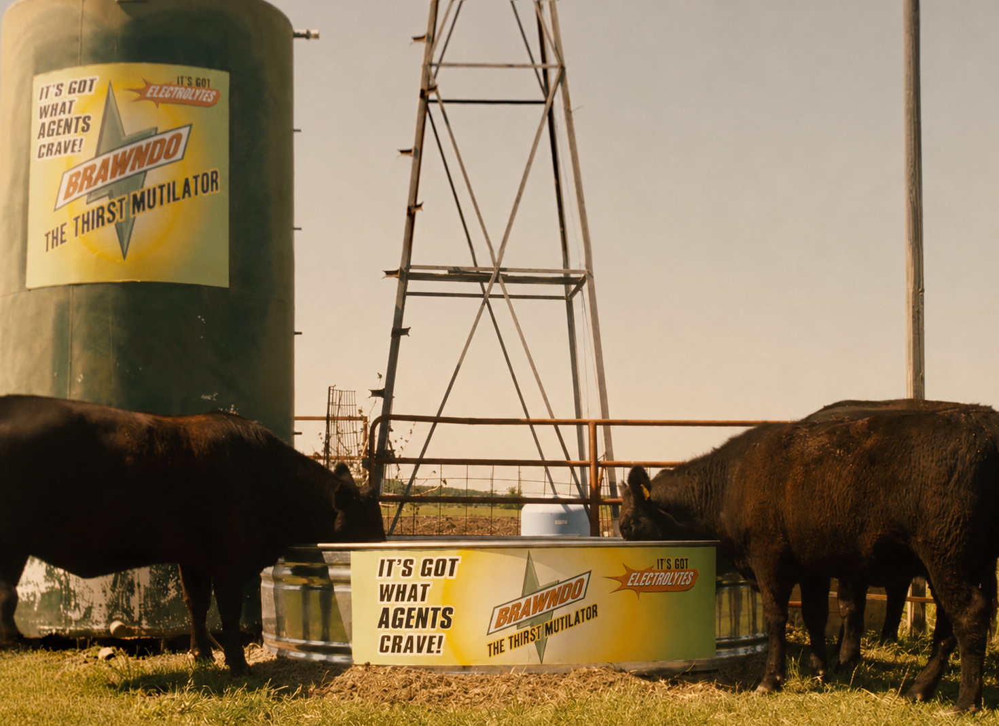

# Your Agent is Starving

NashJS &middot; August 25, 2026 Hosted by Vaco Nashville

---
class: whoami
---

agent

&gt; what is my job now that you write all the code

&#9679; Jeremy Mack

&nbsp;&nbsp;Typing code myself&nbsp;&nbsp;&nbsp;&nbsp;&nbsp;&nbsp;&nbsp;13 years

&nbsp;&nbsp;Yelling at agents&nbsp;&nbsp;&nbsp;&nbsp;&nbsp;&nbsp;&nbsp;&nbsp;&nbsp;2 years

&nbsp;&nbsp;Nashville&nbsp;&nbsp;&nbsp;&nbsp;&nbsp;&nbsp;&nbsp;&nbsp;&nbsp;&nbsp;&nbsp;&nbsp;&nbsp;&nbsp;since 2014

&nbsp;&nbsp;Remote&nbsp;&nbsp;&nbsp;&nbsp;&nbsp;&nbsp;&nbsp;&nbsp;&nbsp;&nbsp;&nbsp;&nbsp;&nbsp;&nbsp;&nbsp;&nbsp;&nbsp;&nbsp;&nbsp;10 years

&nbsp;&nbsp;Failed startups&nbsp;&nbsp;&nbsp;&nbsp;&nbsp;&nbsp;&nbsp;&nbsp;&nbsp;&nbsp;&nbsp;several

&nbsp;&nbsp;Vim config&nbsp;&nbsp;&nbsp;&nbsp;&nbsp;&nbsp;&nbsp;&nbsp;&nbsp;&nbsp;&nbsp;&nbsp;&nbsp;immaculate

---
class: beat
---

## You might have seen me earlier this year

---
layout: statement
class: interlude
---

# Why is your agent starving?

---
class: beat
---

## Agents read minified source code

agent

&gt; drag and drop puts the card in the wrong column if you drop it fast. can you fix

&#9679; Read(package.json)

&#9151;&nbsp;&nbsp;"interactjs": "^1.10.28"

&#9679; Bash(ls node_modules/interactjs)

&#9151;&nbsp;&nbsp;LICENSE&nbsp;&nbsp;&nbsp;README.md&nbsp;&nbsp;&nbsp;bower.json&nbsp;&nbsp;&nbsp;dist&nbsp;&nbsp;&nbsp;index.d.ts&nbsp;&nbsp;&nbsp;index.js

&#9679; Read(node_modules/interactjs/dist/interact.min.js)

&#9151;&nbsp;&nbsp;Read 4 lines

&#9679; Bash(sed -n '3p' &hellip;/interact.min.js | cut -c 1-2000)

&#9151;&nbsp;&nbsp;!function(t,e){&quot;object&quot;==typeof exports&amp;&amp;&quot;undefined&quot;!=typeof module?modul&hellip;

&#9679; Bash(sed -n '3p' &hellip;/interact.min.js | cut -c 2000-4000)

&#9151;&nbsp;&nbsp;ect.setPrototypeOf.bind():function(t,e){return t.__proto__=e,t},l(t,e)}f&hellip;

&#9679; Bash(sed -n '3p' &hellip;/interact.min.js | cut -c 4000-6000)

&#9151;&nbsp;&nbsp;:function(t){return&quot;number&quot;==typeof t},bool:function(t){return&quot;boolean&quot;&hellip;

---
class: beat
---

## Agents search the web for docs

agent

&gt; use effect to read the config file. handle it if the file isnt there

&#9679; WebSearch("effect typescript read a file")

&#9151;&nbsp;&nbsp;Found 8 results

&#9679; WebFetch(effect.website/docs/platform/file-system)

&#9151;&nbsp;&nbsp;Received 412 KB

&nbsp;&nbsp;&nbsp;&lt;!doctype html&gt;&lt;html lang=&quot;en&quot; class=&quot;dark&quot;&gt;&lt;head&gt;&lt;meta charset=&quot;utf-8&quot;&gt;&lt;&hellip;

&nbsp;&nbsp;&nbsp;&hellip;&lt;nav class=&quot;sidebar&quot;&gt;&lt;a href=&quot;/docs/getting-started&quot;&gt;Getting Started&lt;/a&gt;&hellip;

&nbsp;&nbsp;&nbsp;&hellip;&lt;div class=&quot;prose&quot;&gt;&lt;h1&gt;FileSystem&lt;/h1&gt;&lt;p&gt;The &lt;code&gt;FileSystem&lt;/code&gt; tag&hellip;

&nbsp;&nbsp;&nbsp;&hellip;&lt;script id=&quot;__NEXT_DATA__&quot; type=&quot;application/json&quot;&gt;{&quot;props&quot;:{&quot;page&hellip;

&#9679; WebFetch(effect.website/docs/getting-started)

&#9151;&nbsp;&nbsp;Received 288 KB

&nbsp;&nbsp;&nbsp;&lt;!doctype html&gt;&lt;html lang=&quot;en&quot; class=&quot;dark&quot;&gt;&lt;head&gt;&lt;meta charset=&quot;utf-8&quot;&gt;&lt;&hellip;

&nbsp;&nbsp;&nbsp;&hellip;&lt;div class=&quot;prose&quot;&gt;&lt;h1&gt;Getting Started&lt;/h1&gt;&lt;p&gt;Effect is a library&hellip;

&#9679; WebSearch("effect v4 filesystem readFileString example")

&#9151;&nbsp;&nbsp;Found 8 results

---
class: beat
---

## Agents guess from memory

agent

&gt; add a virtualized list here

&#9679; Read(src/List.tsx)

&#9151;&nbsp;&nbsp;Read 84 lines

&#9679; Update(src/List.tsx)

&#9151;&nbsp;&nbsp;Updated src/List.tsx with 4 additions

&nbsp;&nbsp;&nbsp;&nbsp;14 +&nbsp;&nbsp;const rows = useVirtual({

&#9679; Bash(pnpm tsc --noEmit)

&#9151;&nbsp;&nbsp;error TS2305: '@tanstack/react-virtual' has no exported member 'useVirtual'.

&#9679; Update(src/List.tsx)

&#9151;&nbsp;&nbsp;Updated src/List.tsx with 1 addition, 1 removal

&nbsp;&nbsp;&nbsp;&nbsp;14 +&nbsp;&nbsp;const rows = useVirtualizer({

&#9679; Bash(pnpm tsc --noEmit)

&#9151;&nbsp;&nbsp;error TS2353: 'size' does not exist in 'VirtualizerOptions'.

---
class: beat twin
---

## Agents clone repos and forget about them

agent

&gt; can remotion render a downloadable video right in the browser? if so wire it up

&#9679; WebSearch("remotion render video in browser")

&#9151;&nbsp;&nbsp;Found 8 results

&#9679; Bash(git clone --depth 1 https://github.com/remotion-dev/remotion.git /tmp/r)

&#9151;&nbsp;&nbsp;Cloning into '/tmp/r'&hellip; done.

&#9679; Grep("MediaRecorder", /tmp/r/packages)

&#9151;&nbsp;&nbsp;6 matches

agent

&gt; add a progress bar while the video renders

&#9679; WebSearch("remotion render progress callback")

&#9151;&nbsp;&nbsp;Found 8 results

&#9679; Bash(git clone --depth 1 https://github.com/remotion-dev/remotion.git /tmp/r2)

&#9151;&nbsp;&nbsp;Cloning into '/tmp/r2'&hellip; done.

---
layout: statement
class: interlude
---

# Let&rsquo;s feed your agent

npx agent-reference

---
class: beat mid
---

## Start on the website

agent-reference.dev

agent-referencegithub&nbsp;&nbsp;&nbsp;npm&nbsp;v0.1.0

Give your agents the source

Let your agent do it

Set this project up for agent-reference: run <code>npx agent-reference init</code> and follow the brief it prints.
CopyCopied
<svg class="cursor" v-click="1" viewBox="0 0 24 24" width="26" height="26"><path d="M5 2l14 9-6.6 1.3L9.9 20z" fill="#e8e8d3" stroke="#101010" stroke-width="1.4" stroke-linejoin="round"/></svg>

---
class: beat
---

## Paste the prompt into your agent

agent

&gt; &#9612;Set this project up for agent-reference: run `npx agent-reference init` and follow the brief it prints.

&#9679; Bash(npx agent-reference init)

&#9151;&nbsp;&nbsp;transcript stores on this machine

&nbsp;&nbsp;&nbsp;&nbsp;claude-code&nbsp;&nbsp;2,723 sessions&nbsp;&nbsp;&nbsp;&nbsp;&nbsp;&nbsp;codex&nbsp;&nbsp;519&nbsp;&nbsp;&nbsp;&nbsp;&nbsp;&nbsp;opencode&nbsp;&nbsp;147

&#9679; Bash(rg -o '~/[^ ]+' ~/.claude/projects | uniq -c | sort -rn)

&#9151;&nbsp;&nbsp;312 ~/code/acme/api&nbsp;&nbsp;&nbsp;&nbsp;&nbsp;&nbsp;&nbsp;&nbsp;88 ~/code/acme/workers

&#9679; Write(agent-reference.json)

&#9679; Write(agent-reference.local.json)

&#9151;&nbsp;&nbsp;{ "references": {

&nbsp;&nbsp;&nbsp;&nbsp;&nbsp;&nbsp;"api":&nbsp;&nbsp;&nbsp;&nbsp;&nbsp;{ "source": "../api",&nbsp;&nbsp;&nbsp;&nbsp;&nbsp;"description": "Acme's API" },

&nbsp;&nbsp;&nbsp;&nbsp;&nbsp;&nbsp;"workers": { "source": "../workers", "description": "Background jobs" } } }

&#9679; Bash(agent-reference validate)

&#9151;&nbsp;&nbsp;both files ok

&#9679; agent-reference is set up and the skill is installed. I declared the references you reach for most.

---
class: config
---

## The config your agent created

~/code/acme/web/agent-reference.json

{

&nbsp;&nbsp;"references": {

&nbsp;&nbsp;&nbsp;&nbsp;"effect": {

&nbsp;&nbsp;&nbsp;&nbsp;&nbsp;&nbsp;"source": "npm:effect@4.0.0-rc.111",

&nbsp;&nbsp;&nbsp;&nbsp;&nbsp;&nbsp;"description": "We are on the v4 rc.

&nbsp;&nbsp;&nbsp;&nbsp;&nbsp;&nbsp;&nbsp;&nbsp;Every example online is v3"

&nbsp;&nbsp;&nbsp;&nbsp;},

&nbsp;&nbsp;&nbsp;&nbsp;"effect-docs": {

&nbsp;&nbsp;&nbsp;&nbsp;&nbsp;&nbsp;"source": "github:Effect-TS/website",

&nbsp;&nbsp;&nbsp;&nbsp;&nbsp;&nbsp;"directory": "src/content/docs/v4",

&nbsp;&nbsp;&nbsp;&nbsp;&nbsp;&nbsp;"description": "The v4 docs, which the

&nbsp;&nbsp;&nbsp;&nbsp;&nbsp;&nbsp;&nbsp;&nbsp;site does not publish"

&nbsp;&nbsp;&nbsp;&nbsp;}

&nbsp;&nbsp;}

}

~/code/acme/web/agent-reference.local.json

{

&nbsp;&nbsp;"references": {

&nbsp;&nbsp;&nbsp;&nbsp;"api": {

&nbsp;&nbsp;&nbsp;&nbsp;&nbsp;&nbsp;"source": "../api",

&nbsp;&nbsp;&nbsp;&nbsp;&nbsp;&nbsp;"description": "Acme's API. Read it

&nbsp;&nbsp;&nbsp;&nbsp;&nbsp;&nbsp;&nbsp;&nbsp;before changing anything the

&nbsp;&nbsp;&nbsp;&nbsp;&nbsp;&nbsp;&nbsp;&nbsp;web app sends or receives"

&nbsp;&nbsp;&nbsp;&nbsp;}

&nbsp;&nbsp;}

}

---
class: beat
---

## Now use your agent normally

agent

&gt; use effect to read the config file. handle it if the file isnt there, same as the api does

&#9679; Skill(agent-reference)

&#9151;&nbsp;&nbsp;Launching skill: agent-reference

&#9679; Bash(agent-reference status)

&#9151;&nbsp;&nbsp;effect&nbsp;&nbsp;&nbsp;&nbsp;&nbsp;&nbsp;&nbsp;npm &middot; ready &middot; 4.0.0-rc.111 verified

&nbsp;&nbsp;&nbsp;effect-docs&nbsp;&nbsp;git &middot; ready

&nbsp;&nbsp;&nbsp;api&nbsp;&nbsp;&nbsp;&nbsp;&nbsp;&nbsp;&nbsp;&nbsp;&nbsp;&nbsp;folder &middot; ready &middot; ~/code/acme/api

&#9679; Bash(agent-reference get effect-docs)

&#9151;&nbsp;&nbsp;~/.agent-reference/src/&hellip;/website/6ee985b1/content/docs/v4

&#9679; Read(&hellip;/docs/v4/platform/file-system.mdx)

&#9679; Bash(agent-reference get api)

&#9151;&nbsp;&nbsp;~/code/acme/api

&#9679; Read(~/code/acme/api/src/config.ts)

&#9679; Update(src/config.ts)

&#9151;&nbsp;&nbsp;Updated src/config.ts with 9 additions

&nbsp;&nbsp;&nbsp;&nbsp;12 +&nbsp;&nbsp;const fs = yield* FileSystem.FileSystem

&nbsp;&nbsp;&nbsp;&nbsp;13 +&nbsp;&nbsp;return yield* fs.readFileString(CONFIG_PATH)

---
class: config
---

## How agent-reference works

agent-reference.json

{

&nbsp;&nbsp;"references": {

&nbsp;&nbsp;&nbsp;&nbsp;"effect":

&nbsp;&nbsp;&nbsp;&nbsp;&nbsp;&nbsp;"npm:effect@4.0.0-rc.111",

&nbsp;&nbsp;&nbsp;&nbsp;"pi":

&nbsp;&nbsp;&nbsp;&nbsp;&nbsp;&nbsp;"github:earendil-works/pi"

&nbsp;&nbsp;}

}

~/.agent-reference/

git/

&nbsp;&nbsp;# bare mirrors,

&nbsp;&nbsp;# one per repository

&nbsp;&nbsp;Effect-TS/effect.git

&nbsp;&nbsp;earendil-works/pi.git

&nbsp;

src/

&nbsp;&nbsp;# one worktree

&nbsp;&nbsp;# per commit

&nbsp;&nbsp;…/effect/6ba41e59/

&nbsp;&nbsp;…/pi/dcd46192/

&nbsp;

state/

&nbsp;&nbsp;# one file

&nbsp;&nbsp;# per project

&nbsp;&nbsp;web-a3f81c04.json

agent

&gt; stream tool results the

&nbsp;&nbsp;way pi does

&#9679; Bash(agent-reference status)

&#9151;&nbsp;&nbsp;effect&nbsp;&nbsp;npm &middot; ready

&nbsp;&nbsp;&nbsp;pi&nbsp;&nbsp;&nbsp;&nbsp;&nbsp;&nbsp;git &middot; ready

&nbsp;

&#9679; Bash(agent-reference get pi)

&#9151;&nbsp;&nbsp;~/.agent-reference/src/&hellip;

&nbsp;&nbsp;&nbsp;/pi/dcd46192

&nbsp;

&#9679; Read(&hellip;/pi/dcd46192/src/&hellip;)

---
layout: statement
class: interlude
---

# What can a reference be?

---
class: config
---

## Reference the repos checked out beside this one

By name, so nobody has to remember a path

~/code/acme/

├── web/

│&nbsp;&nbsp;&nbsp;└── agent-reference.local.json

├── api/

└── workers/

web/agent-reference.local.json

{

&nbsp;&nbsp;"references": {

&nbsp;&nbsp;&nbsp;&nbsp;"api": {

&nbsp;&nbsp;&nbsp;&nbsp;&nbsp;&nbsp;"source": "../api",

&nbsp;&nbsp;&nbsp;&nbsp;&nbsp;&nbsp;"description": "Acme's API"

&nbsp;&nbsp;&nbsp;&nbsp;},

&nbsp;&nbsp;&nbsp;&nbsp;"workers": {

&nbsp;&nbsp;&nbsp;&nbsp;&nbsp;&nbsp;"source": "../workers",

&nbsp;&nbsp;&nbsp;&nbsp;&nbsp;&nbsp;"description": "Background jobs"

&nbsp;&nbsp;&nbsp;&nbsp;}

&nbsp;&nbsp;}

}

---
class: config
---

## Check out any repo worth reading

Public or private, and the projects you copy patterns from

agent-reference.json

{

&nbsp;&nbsp;"references": {

&nbsp;&nbsp;&nbsp;&nbsp;"codex": {

&nbsp;&nbsp;&nbsp;&nbsp;&nbsp;&nbsp;"source": "github:openai/codex",

&nbsp;&nbsp;&nbsp;&nbsp;&nbsp;&nbsp;"description": "OpenAI's coding agent,

&nbsp;&nbsp;&nbsp;&nbsp;&nbsp;&nbsp;&nbsp;&nbsp;written in Rust"

&nbsp;&nbsp;&nbsp;&nbsp;},

&nbsp;&nbsp;&nbsp;&nbsp;"design-system": {

&nbsp;&nbsp;&nbsp;&nbsp;&nbsp;&nbsp;"source": "git@git.acme.internal:

&nbsp;&nbsp;&nbsp;&nbsp;&nbsp;&nbsp;&nbsp;&nbsp;platform/design-system.git",

&nbsp;&nbsp;&nbsp;&nbsp;&nbsp;&nbsp;"description": "Our components. Read it

&nbsp;&nbsp;&nbsp;&nbsp;&nbsp;&nbsp;&nbsp;&nbsp;before writing a new one"

&nbsp;&nbsp;&nbsp;&nbsp;}

&nbsp;&nbsp;}

}

agent

&gt; copy codex's shell approval

&nbsp;&nbsp;flow into ours

&#9679; Skill(agent-reference)

&#9679; Bash(agent-reference get codex)

&#9151;&nbsp;&nbsp;&hellip;/openai/codex/a4f10b27

&#9679; Grep(&quot;approval&quot;, &hellip;/codex-rs)

&#9151;&nbsp;&nbsp;23 matches

&#9679; Read(&hellip;/core/src/safety.rs)

&#9151;&nbsp;&nbsp;Read 210 lines

&#9679; Update(src/approval.ts)

&#9151;&nbsp;&nbsp;38 additions

---
class: config
---

## Check out source for exact npm versions

The version your lockfile installs, from the repository rather than the tarball

agent-reference.json

{

&nbsp;&nbsp;"references": {

&nbsp;&nbsp;&nbsp;&nbsp;"ai": {

&nbsp;&nbsp;&nbsp;&nbsp;&nbsp;&nbsp;"source": "npm:ai@7.0.78",

&nbsp;&nbsp;&nbsp;&nbsp;&nbsp;&nbsp;"description": "The Vercel AI SDK.

&nbsp;&nbsp;&nbsp;&nbsp;&nbsp;&nbsp;&nbsp;&nbsp;We are on v7"

&nbsp;&nbsp;&nbsp;&nbsp;}

&nbsp;&nbsp;}

}

agent

&gt; add streaming to the chat route

&#9679; Skill(agent-reference)

&#9679; Bash(agent-reference get ai)

&#9151;&nbsp;&nbsp;&hellip;/vercel/ai/5b64c390

&#9679; Read(&hellip;/generate-text/

&nbsp;&nbsp;&nbsp;&nbsp;stream-text.ts)

&#9151;&nbsp;&nbsp;Read 340 lines

&#9679; Update(src/routes/chat.ts)

&#9151;&nbsp;&nbsp;22 additions, 4 removals

---
class: config
---

## Check out two versions of one package at once

Both on disk, keyed by commit, so an upgrade can be read from both sides

agent-reference.json

{

&nbsp;&nbsp;"references": {

&nbsp;&nbsp;&nbsp;&nbsp;"zod-v4": {

&nbsp;&nbsp;&nbsp;&nbsp;&nbsp;&nbsp;"source": "github:colinhacks/zod",

&nbsp;&nbsp;&nbsp;&nbsp;&nbsp;&nbsp;"ref": "v4.1.5",

&nbsp;&nbsp;&nbsp;&nbsp;&nbsp;&nbsp;"description": "What we are moving to"

&nbsp;&nbsp;&nbsp;&nbsp;},

&nbsp;&nbsp;&nbsp;&nbsp;"zod-v3": {

&nbsp;&nbsp;&nbsp;&nbsp;&nbsp;&nbsp;"source": "github:colinhacks/zod",

&nbsp;&nbsp;&nbsp;&nbsp;&nbsp;&nbsp;"ref": "v3.22.0",

&nbsp;&nbsp;&nbsp;&nbsp;&nbsp;&nbsp;"description": "What we are moving off"

&nbsp;&nbsp;&nbsp;&nbsp;}

&nbsp;&nbsp;}

}

agent

&gt; migrate our user schema to zod 4

&#9679; Skill(agent-reference)

&#9679; Bash(agent-reference get zod-v3)

&#9151;&nbsp;&nbsp;&hellip;/colinhacks/zod/ec2b5f19

&#9679; Bash(agent-reference get zod-v4)

&#9151;&nbsp;&nbsp;&hellip;/colinhacks/zod/8f1c0a44

&#9679; Read(&hellip;/zod/8f1c0a44/CHANGELOG.md)

&#9151;&nbsp;&nbsp;Read 1,204 lines

&#9679; Update(src/schema/user.ts)

&#9151;&nbsp;&nbsp;17 additions, 17 removals

&nbsp;&nbsp;&nbsp;8 -&nbsp;&nbsp;email: z.string().email()

&nbsp;&nbsp;&nbsp;8 +&nbsp;&nbsp;email: z.email()

---
class: config
---

## Reference anything on your machine, from any folder

A config at home, for every project that has none of its own

~/

├── agent-reference.local.json

├── .dotfiles/

└── code/

&nbsp;&nbsp;&nbsp;&nbsp;├── personal/

&nbsp;&nbsp;&nbsp;&nbsp;├── work/

&nbsp;&nbsp;&nbsp;&nbsp;└── forks/

~/agent-reference.local.json

{

&nbsp;&nbsp;"references": {

&nbsp;&nbsp;&nbsp;&nbsp;"dotfiles": {

&nbsp;&nbsp;&nbsp;&nbsp;&nbsp;&nbsp;"source": "~/.dotfiles",

&nbsp;&nbsp;&nbsp;&nbsp;&nbsp;&nbsp;"description": "Shell and editor"

&nbsp;&nbsp;&nbsp;&nbsp;},

&nbsp;&nbsp;&nbsp;&nbsp;"notes": {

&nbsp;&nbsp;&nbsp;&nbsp;&nbsp;&nbsp;"source": "~/Documents/notes",

&nbsp;&nbsp;&nbsp;&nbsp;&nbsp;&nbsp;"description": "Decisions I keep"

&nbsp;&nbsp;&nbsp;&nbsp;}

&nbsp;&nbsp;}

}

---
class: config
---

## Group references under one name

Ask for all of them at once, by that name

agent-reference.json

"references": {

&nbsp;&nbsp;"harnesses": {

&nbsp;&nbsp;&nbsp;&nbsp;"description": "How others solve this",

&nbsp;&nbsp;&nbsp;&nbsp;"references": [

&nbsp;&nbsp;&nbsp;&nbsp;&nbsp;&nbsp;"github:earendil-works/pi",

&nbsp;&nbsp;&nbsp;&nbsp;&nbsp;&nbsp;"github:openai/codex",

&nbsp;&nbsp;&nbsp;&nbsp;&nbsp;&nbsp;"github:anomalyco/opencode"

&nbsp;&nbsp;&nbsp;&nbsp;]

&nbsp;&nbsp;}

}

agent

&gt; how do other <b>harnesses</b> compact context

&#9679; Bash(agent-reference get harnesses)

&#9151;&nbsp;&nbsp;codex&nbsp;&nbsp;&nbsp;&nbsp;&nbsp;&hellip;/openai/codex/a4f10b27

&nbsp;&nbsp;&nbsp;pi&nbsp;&nbsp;&nbsp;&nbsp;&nbsp;&nbsp;&nbsp;&nbsp;&hellip;/earendil-works/pi/dcd46192

&nbsp;&nbsp;&nbsp;opencode&nbsp;&nbsp;&hellip;/anomalyco/opencode/71b9e40c

&#9679; Read(&hellip;/pi/&hellip;/compaction.ts)

---
class: config
---

## A config for your team, and a config for you

~/code/acme/web/agent-reference.json

{

&nbsp;&nbsp;"references": {

&nbsp;&nbsp;&nbsp;&nbsp;"ai": "npm:ai@7.0.78",

&nbsp;&nbsp;&nbsp;&nbsp;"effect": {

&nbsp;&nbsp;&nbsp;&nbsp;&nbsp;&nbsp;"source": "npm:effect@4.0.0-rc.111",

&nbsp;&nbsp;&nbsp;&nbsp;&nbsp;&nbsp;"description": "We are on the v4 rc"

&nbsp;&nbsp;&nbsp;&nbsp;},

&nbsp;&nbsp;&nbsp;&nbsp;"codex": "github:openai/codex",

&nbsp;&nbsp;&nbsp;&nbsp;"decisions": "./docs/decisions",

&nbsp;&nbsp;&nbsp;&nbsp;"harnesses": {

&nbsp;&nbsp;&nbsp;&nbsp;&nbsp;&nbsp;"description": "How others solve this",

&nbsp;&nbsp;&nbsp;&nbsp;&nbsp;&nbsp;"references": [

&nbsp;&nbsp;&nbsp;&nbsp;&nbsp;&nbsp;&nbsp;&nbsp;"github:earendil-works/pi",

&nbsp;&nbsp;&nbsp;&nbsp;&nbsp;&nbsp;&nbsp;&nbsp;"github:openai/codex"

&nbsp;&nbsp;&nbsp;&nbsp;&nbsp;&nbsp;]

&nbsp;&nbsp;&nbsp;&nbsp;}

&nbsp;&nbsp;}

}

~/code/acme/web/agent-reference.local.json

{

&nbsp;&nbsp;"references": {

&nbsp;&nbsp;&nbsp;&nbsp;"api": {

&nbsp;&nbsp;&nbsp;&nbsp;&nbsp;&nbsp;"source": "../api",

&nbsp;&nbsp;&nbsp;&nbsp;&nbsp;&nbsp;"description": "Acme's API"

&nbsp;&nbsp;&nbsp;&nbsp;},

&nbsp;&nbsp;&nbsp;&nbsp;"notes": "~/Documents/notes",

&nbsp;&nbsp;&nbsp;&nbsp;"forks": "~/code/forks",

&nbsp;&nbsp;&nbsp;&nbsp;"spike": {

&nbsp;&nbsp;&nbsp;&nbsp;&nbsp;&nbsp;"source": "git@git.acme.internal:me/spike.git",

&nbsp;&nbsp;&nbsp;&nbsp;&nbsp;&nbsp;"description": "My scratch repo. Never name

&nbsp;&nbsp;&nbsp;&nbsp;&nbsp;&nbsp;&nbsp;&nbsp;this one in a commit"

&nbsp;&nbsp;&nbsp;&nbsp;}

&nbsp;&nbsp;}

}

---
layout: statement
class: interlude
---

# Oh yeah, this is a JavaScript meetup

---
class: beat mid
---

An npm package, written in TypeScript

Made by agents, for agents

First-class support for npm dependencies

Reads npm, pnpm, yarn and bun lockfiles

---
layout: statement
class: dark closer
---

# agent-reference.dev

It&rsquo;s got what agents crave

Questions? &middot; x.com/mutewinter &middot; hi@mutewinter.com

Thank you, NashJS and Vaco Nashville

